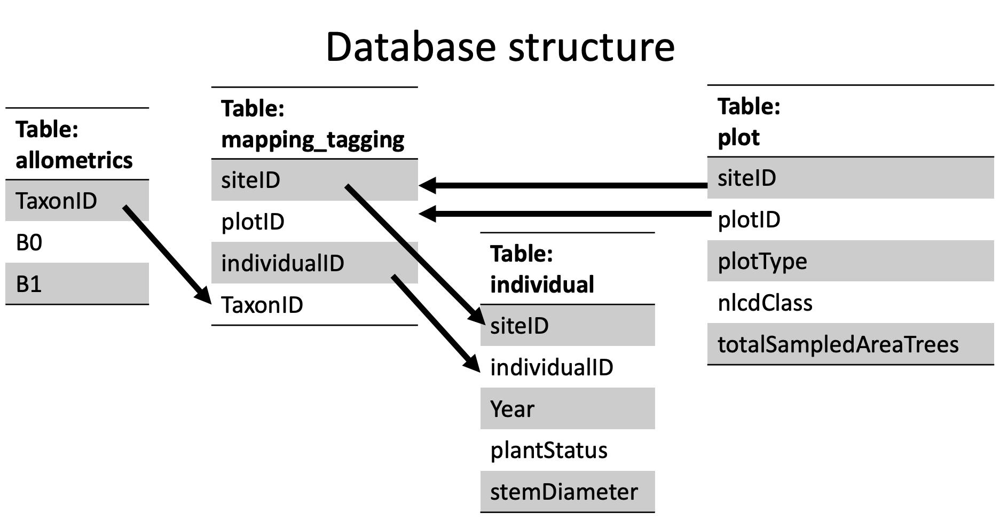
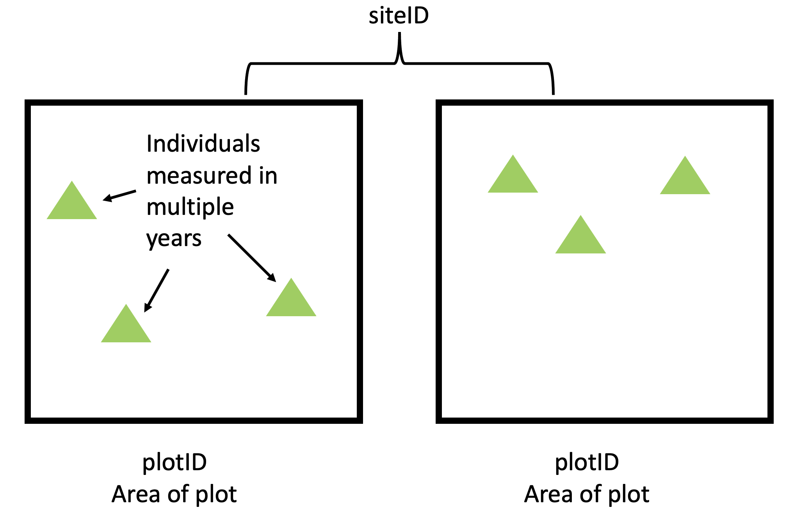
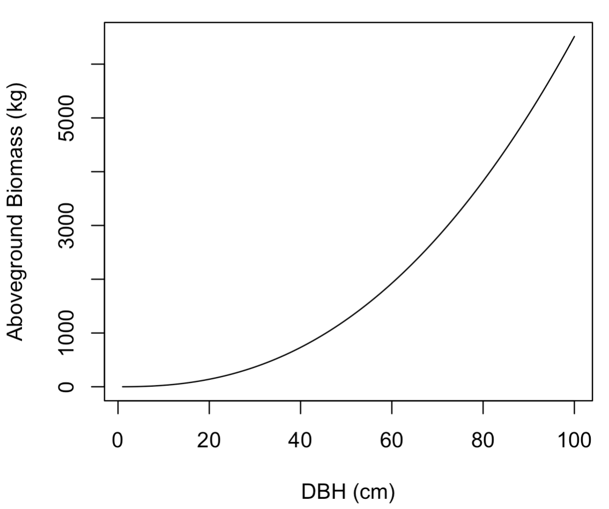
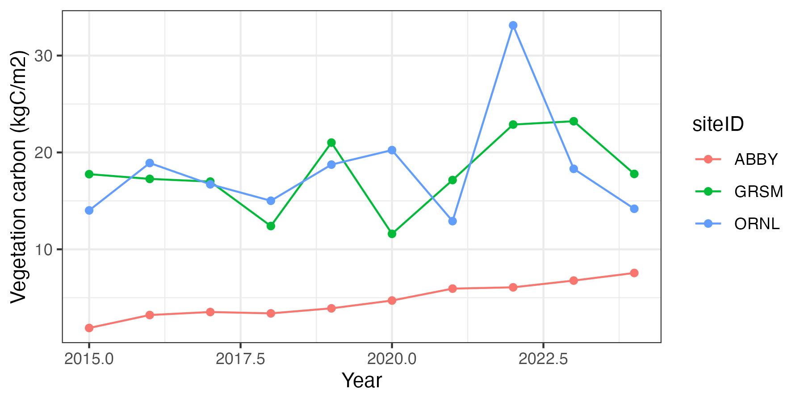

```{r}
library(tidyverse)
library(lubridate)
library(knitr)
library(duckdb)
library(DBI)
```

## Science question

How much carbon is stored in a forest ecosystem and how does it differ across the U.S.?

## Background on estimating carbon stocks

One common approach to estimating carbon in woody vegetation is by measuring the diameter of each individual tree over a certain size in a set area (called a plot).  The diameter of each tree is converted to mass (called biomass) using equations that use diameter to predict biomass (called allometric relationships). Allometric relationships are statistical relationships that are created by measuring a tree's diameter before cutting down and weighing it.  A general relationship for a species can be created by combining these harvested trees into a single analysis.  Allometric relationships typically estimate aboveground biomass which needs to be converted to carbon by multiplying by 0.5 (biomass is about 50% carbon).  

Total biomass of a tree is the sum of aboveground and belowground carbon.  Since belowground carbon is less commonly measured (it requires digging up the tree roots), we can use ratios of aboveground to belowground carbon from a limited set of trees where the entire tree was extracted to calculate total tree tree carbon.  

Once total tree carbon is calculated for each tree (i.e., units of kg C per tree) in a plot, the density of carbon for each plot (i.e., kg C per m2) is calculated by summing across the individual trees and dividing the plot sum by the plot area.

## Your charge!

I am a client interested in the carbon storage in vegetation of different ecosystems across the continental U.S. to guide my investment in the California Carbon Market. 

I need carbon stocks using measurements for the following sites within the National Ecological Observatory Network.  In particular, I am interested in the following sites:

- Blandy Experimental Farm (siteID: BLAN)
- Bartlett Experimental Forest (siteID: BART)
- Mountain Lake Biological Station (siteID: MLBS)
- Ordway-Swisher Biological Station (siteID: OSBS)

## Part 1: Develop hypotheses

Explore the descriptions of our four focal NEON sites at https://www.neonscience.org/field-sites/field-sites-map/list, how the sites look on the satellite image in the site description, and your general knowledge about ecosystem science to develop your hypothesized for the following question: 

**Question 1**

Based on information about location and ecosystem type, rank the sites in order of 1 = most vegetation carbon, 4 = least vegetation carbon. Provide a justification for your ranking.

**Answer 1**


   
## Part 2: Download and Merge data products

This module uses data from the [National Ecological Observatory Network](https://www.neonscience.org).  Specifically, it uses the Vegetation Structure data product: [DP1.10098.001](https://data.neonscience.org/data-products/DP1.10098.001).  

Working with data from NEON, and many other data sources, requires working with data spread across different data tables.  For exampe, one table may include the climate data for a set of focal locations while another table may include data collected on a visit to the site.  Higher-level analyses that use the climate data to understand the field date require linking the two tables.

Furthermore, environmental data can be "big data".  There are many definitions of big data but I will use a simple one: the computer memory (RAM, not hard disk) required to store your data is bigger than your computer.  When using this "big data", you will crash your computer if you try to load or read in all the data at once.  

Note: typical RAM on a labtop is 8 - 16 GB and Hard Disk is 500 - 1 TB so you can store more on your hard disk than you can analyze in R.

### Working with databases in R

Databases are a solution.  They allow you to load only the parts of the data that you want to analyze into memory while leaving the rest on your much larger hard disk.  

In this module you will be working with the NEON data in a database form.  I have cleaned up the NEON data from the raw form into structure that is better suited for learning how to work with databases and joins. The data is real and the analysis that you will produce is genuine.  

The database a collection of data tables stored a single file called `neon.duckdb` in the `assignment/data` subdirectory.  

You can learn more about databases in R [here](https://r4ds.hadley.nz/databases.html) and about the particular type of database called a [DuckDB](https://r4ds.hadley.nz/databases.html#in-this-book)

First you need to [connect]([https://r4ds.hadley.nz/databases.html#in-this-book]) to the database using the `dbConnect` function in the `DBI` package.  You need to tell it the type of database (`duckdb()`) and the directory of the database file.  
[https://r4ds.hadley.nz/databases.html#in-this-book]

```{r}
con <- dbConnect(duckdb(),
                 dbdir="data/neon.duckdb")
```

The connection does not load any data into memory for you to analyze.  The connections allows to start looking at the database before loading data into memory.  

First, what tables are in the [database]([https://r4ds.hadley.nz/databases.html#in-this-book])?

```{r}
dbListTables(con)
```

To load data into memory for analysis as a dataframe (i.e., move the data from hard disk to RAM), use the `tbl` [function](https://r4ds.hadley.nz/databases.html#dbplyr-basics).  It requires the connection name and the table name

```{r}
individual <- tbl(con, "individual")
```

Imagine that the individual table is huge (like every tree measured by the Forest Service across the U.S.).  We don't want to use the `tbl` function to load all the data into RAM because that will cause R to crash.  

Fortunately, R uses the concept of "lazy loading".  First you can look at the `individual` table to get a preview of the table that looks like the table.

```{r}
individual
```

However, if you look deeper, it doesn't have all the rows. The preview seems to only have 1000 rows.  In fact it does not have any rows

```{r}
nrow(individual)
```

This is because the data won't be loaded into memory until you specifically tell it to do so (hence being "lazy").  The [`collect()` function](https://r4ds.hadley.nz/databases.html#dbplyr-basics) is what finally pulls the data into memory. In the example below you can see that there are now many rows of data.


```{r}
individual <- tbl(con, "individual") |> 
  collect()
nrow(individual)
```

However, "collecting" the entire data table does not leverage the power of using a database because it pulling the entire data table into memory.  The advantage of using a database is that you can only load the data that you actually need.  In many cases you don't need all rows or columns of a data table for your analysis.  

For example, the individual table has many more sites (`siteID`) than we want.  

```{r}
individual |> distinct(siteID)
```

You can `filter` only the rows you want before calling `collect`.  Any filtering or selecting before a collect call will reduce the size of the data that you are actually moving from hard disk to RAM. The following uses the `%in%` function to asks to keep data from any of the three `siteID` values in the vector.

```{r}
individual <- tbl(con, "individual") |> 
  filter(siteID %in% c("ABBY","GRSM", "ORNL")) |> 
  collect()
```

### Joining tables in R

Data in databases are spread across tables.  This is done to help reduce the size of the data.  For example, if every tree is in a site and each site in in domain, do we need to have a column for the domainID in the same table as the individual trees? We could but adding the extra column with a lot of repeated information (i.e., if there are 90 sites but three domains then the same three domains will be repeated over and over in the column) would require unnecessary use of storage and memory.  Or can we have the siteID in the tree table and another table that has the domainID that each site belongs to? This would reduce the storage requirement for the database.  Therefore, databases use multiple tables.

However, what if you want to filter the trees by which domain they are in? What if you want to average the trees at the domain scale?  To do this, you actually need a domain column in the same table as your trees.  "Joining" is how you combine the two tables together.  

Please read more about joins [here](https://r4ds.hadley.nz/joins.html).

There are many types of joins.  [ADD LIST]. 

```{r}
neon_domains <- tbl(con, "domains") |> 
  filter(siteID %in% c("ABBY","GRSM", "ORNL")) |> 
  collect()
```

We are going to use a left join because we want to keep all the rows in the table on the left of the function call (individual) and merge in the matching data from the right table in the function call (neon_domains).  By using siteID as the matching key (`by = "siteID"`), we are assigning the values in the other columns of the domains table (i.e., domainID) to the rows with matching siteID.  If there are rows in the left table (individual) that don't have matching siteIDs in the right table, the join puts in NA for domainID in the left table.  If there are multiple rows in the right table that match a row in the left table in an error occurs.

```{r}
individual_domain <- left_join(individual, neon_domains, by = "siteID")
```

Again, the (`by = "siteID"`) is the matching key.  There can be multiple columns used to match (e.g. (`by = c("siteID", "individualID`)) if necessary to correctly join two tables.

Following the left, we can see that there is a new column called `domainID`.

```{r}
colnames(individual_domain)
```

We can also see that all rows for a siteID share the same domainID.

```{r}
individual_domain |> filter(siteID == "ORNL") |> select(siteID, individualID, domainID)
```

### String operations

One addition skill you will need to use the NEON data is the capacity to filter using part of string.  Thus far you have used strings to filter like the following

```{r}
individual_domain |> filter(domainID == "D07") |> 
  select(-plantStatus, -stemDiameter)
```

However, often you want to filter by the presences of particular characters in a string.  For example, you have "Virginia Tech","University of Virginia", and "University of North Carolina" in your dataset and you want to filter to keep only universities in "Virginia".  Instead of doing the following:

```
filter(university %in% c("Virginia Tech", "University of Virginia"))
```
you could filter on the presence of the word "Virginia" in the university variable.  To do this, you can use a function from the [`stringr` package](https://r4ds.hadley.nz/strings.html) called `str_detect()`.  The function return TRUE or FALSE if the value for the variable has that string in it.  You then filter using the function

```
filter(str_detect(university, "Virginia"))
```

In the NEON data, each tree has an individualID.  Imagine that we did not have our table with domainID but you only wanted trees from domain 7 (`D07`).  Notice how the individualID is a string and the string has the domainID in it (example below is from the first row of the data).

```{r}
individual$individualID[1]
```

You can use the str_detect with a filter to only keep individuals that are in domain 7 using the string `"D07"`.  You can see in the code below that only siteID from D07 remain the dataset.

```{r}
individual_domain |> filter(str_detect(individualID, "D07")) |> 
  distinct(siteID, domainID)

```
 The stringr package has many other useful functions for working with strings.  For example, [`separate_wider_delim`](https://r4ds.hadley.nz/strings.html#sec-string-columns) can be used to separate the individualID into its components.
 
```{r}
 individual_domain |> 
  separate_wider_delim(
    individualID,
    delim = ".",
    names = c("NEON", "data_type", "new_domainID","new_siteID","individual_tag")
  )
```

or maybe you just want only the NEON part.  You can use `str_sub` to subset only the first 4 characters of the string.  The start is the first position in the string you want to keep and the end is the last position you want to keep.

```{r}
individual_domain |> 
  mutate(project = str_sub(individualID, start = 1, end = 4)) |> 
  select(project, individualID)
```

Overall, the `stringr` package in the tidyverse is very useful for working with strings in data frames.  You can learn more [here](https://r4ds.hadley.nz/strings.html#subsetting)

## Part 3: Examine data


 

     
    


**Answer the following questions:** 

1) How are the following columns in the data product related?

  * siteID:   
  * plotID:   
  * individualID:   
  * taxonID:   
  * year:   

2) What information to you need to calculate live vegetation stocks at the individual tree, plot, and site level - refer to **Background on estimating carbon stocks** and the Science Introduction presentation.
  
  * individual tree:   
  * plot:   
  * site:   
  
3) Based you answer to #2, what are the variable names in the data product that have the information that you need?


4) Based you answer to #3, what tables are those variables names found?

## Part 5: Calculate carbon in live trees

This step will challenge you to develop a workflow using the data science skills to calculate the carbon stocks in live trees at each of the four sites.  For each site, you should have a **site-level** mean carbon stock in **live trees** for **each year** with measurements.  Your estimate will be from the plots that are sampling the ecosystem under the flux tower - called **tower** plots.  See https://www.neonscience.org/field-sites/field-sites-map/BART for an example map of a plot with the tower plots labeled (Tower Base Plot)

Hints for calculating carbon in live trees:

- The `plantStatus` column has whether the tree was alive at the time of measurement, but  there are multiple types of live trees. Be sure your analysis includes all the types of live trees. You may need to use string manipulation and filter functions in the `stringr` package.   
- The Climate Action Reserve project (an official carbon accounting organization for the California Carbon Exchange) provides allometric relationships to use to calculate **aboveground biomass**. The allometric equations for each species can be found in the "allometrics" table.  Places this file in. You will need to **join** the parameters (B0 and B1) in "allometrics" to your table with the diameter measurements. The parameters we use come from Table 4 in the Jenkins et al. 2003 in the assignments directory. The equation for converting diameter to biomass is at the bottom of Table 4 in Jenkins et al. 2003. 
- After calculating the aboveground biomass, you will need to calculate the belowground biomass (i.e., roots).  Belowground biomass is assumed to be 30% of aboveground biomass Be sure to add this additional biomass to your calculation of vegetation biomass.
- Remember that only 50% of biomass is carbon so you will need to convert from biomass to carbon.   
- The **site level** value in each year is the mean of the plots at the site. Don't forget that we are only interested in the "Tower" plots.
- Be very careful with the units at each step: the final units should be kgC m^-2 (Kilogram of carbon per meter squared).  The order of magnitude should be 1 - 100. 

Remember to review the description in **Background on estimating carbon stocks** about how to calculate carbon stocks.

```{r}
#INSERT CODE
```

## Part 6:  Create report

I am looking for the following plots, tables, and text in the Rmarkdown document:

- A figure showing the mean live tree carbon stocks in each site and year. You will have year on the axis and carbon stocks on the y-axis with different lines for each site.  Remember to have clear axis labels and to include the units. Here is an example of the plot for a different set of sites.  

   

```{r}
#INSERT CODE
```

- Summarized table of values for the site level carbon stocks averaged across years and plots (I recommend using the `kable()` function to generate a clean looking table).

```{r}
#INSERT CODE
```

- Text describing issues that you had with your analysis, concerns you have with your analysis, and concerns you have with the data.
  
- Text describing whether your data analysis supported your hypothesis from Part #1 and, if not, possible reasons why it did not.

Be sure your figures are complete with units, labels, and a title.  Be sure your figures and tables are legible when knitted.
