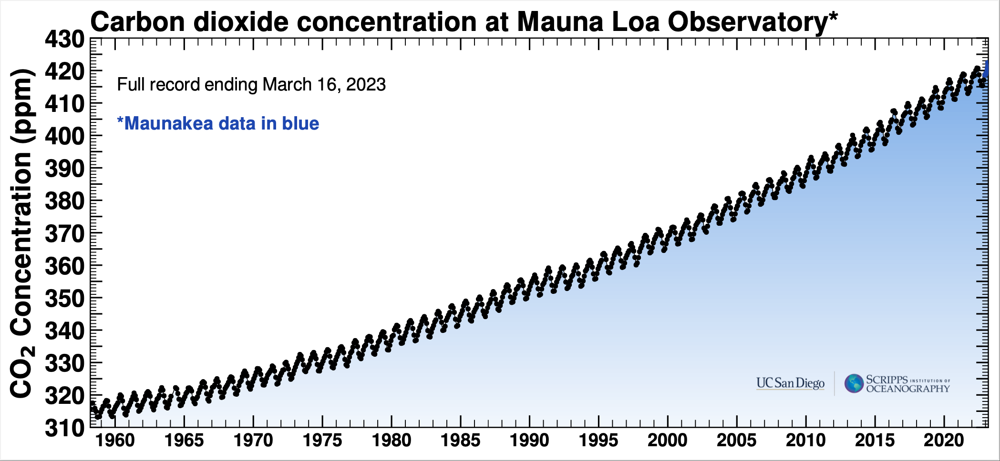
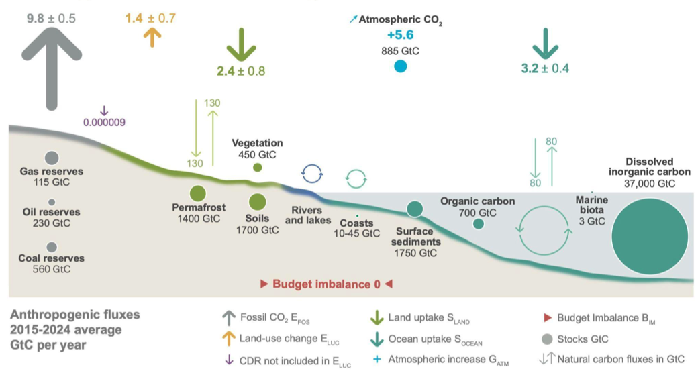
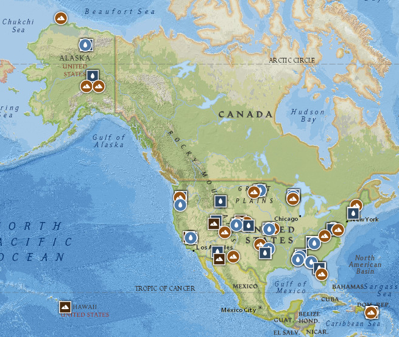
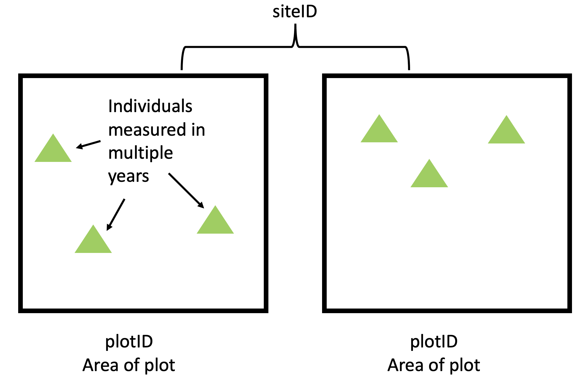
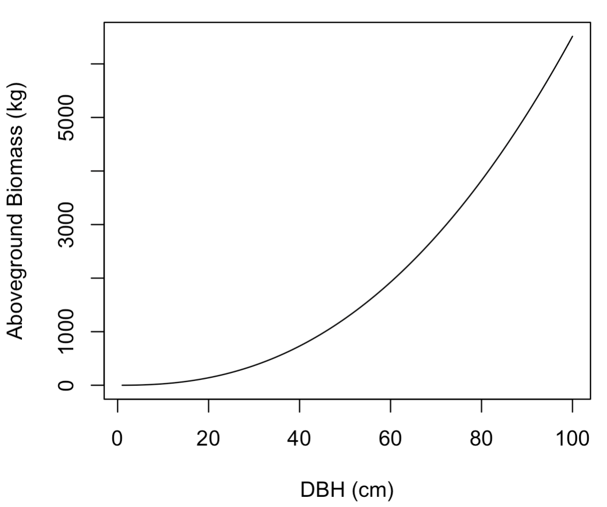
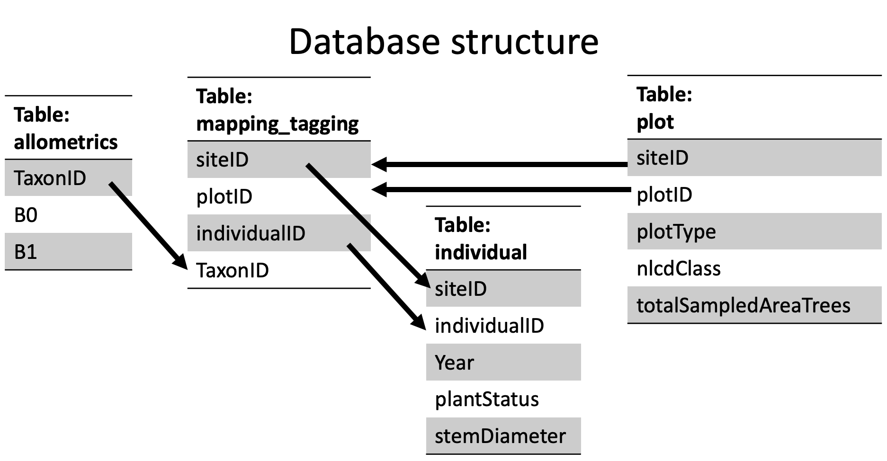

## Atmospheric CO~2~ is rising

{fig-align="center" fig-alt="graph of atmospheric CO2 over time from the Keeling Curve"}

::: aside
https://keelingcurve.ucsd.edu
:::

## What can we do reduce atmospheric CO~2~?

-   Decrease emissions of fossil fuels
-   Increase removals from the atmosphere
-   What removes CO~2~ from the atmosphere?

## Concepts in the global carbon budget

-   ⚫️ Stocks: where you can find carbon stored
-   ⬆️ Fluxes: the transfer of carbon between stocks
-   Units are Gigatons of C / year (Giga = 10\^9, 1 ton = 1000 grams)
-   1 Gt = 1,000,000,000 water bottles

## Global Carbon Budget

{fig-align="center" fig-alt="diagram of 2022 global carbon budget"}

~https://doi.org/10.5194/essd-2025-659~

## Role of vegetation in global carbon budget

-   9.8 Gt/yr emissions to atmospheric CO~2~ 
-   Atmospheric CO~2~ only goes up by 5.6 (Gt/yr) = 57% (half the warming!)
-   25% of emissions are absorbed by terrestrial ecosystems

## Vegetation carbon is important

-   Increasing carbon on land (e.g., forests) decreases carbon in the atmosphere
-   Decreasing carbon in the atmosphere, decreasing global temperatures (or prevents more warming)
-   Can we manage the land to increase the amount of carbon in ecosystems?
-   Basis for carbon markets - you pay for my extra ecosystem carbon to offset your fossil fuel emissions)

## Measuring Carbon: NEON



## NEON: 81 sites

{fig-align="center" width="592" fig-alt="Map of NEON sites"}

::: aside
https://www.neonscience.org/field-sites/explore-field-sites
:::

## NEON Woody Carbon

-   Each site has a set of plots (either "tower" or "distributed")
-   Each tree is mapped (species)
-   Each year, each tree is measured: status (live or dead) and diameter

{fig-align="center" fig-alt="diagram of NEON plot design"}

## NEON Woody Carbon

-   Diameter can be converted to biomass using "allometric" relationships
-   Biomass can be converted to carbon (carbon = biomass x 0.5)
-   Allometric relationships are from Jenkin et al. (2004)

{fig-align="center" fig-alt="graph of allometric relationship"}

## NEON Woody Carbon

-   Carbon for individual trees is summed within a plot to determine the plot carbon each year
-   The summed carbon is divided by the area (m\^2) of the plot to standardize across plots of different size
-   All plots within a site averaged to get a site-level carbon for each year.

{fig-align="center" fig-alt="diagram of NEON site design"}

## Structure of data

-   Data is spread across multiple tables
-   The data are stored in a relational database.

{fig-align="center" fig-alt="diagram database table relationship"}

## New skills

-   Reading in database in R (`collect`)
-   Joining tables to create data frames for analysis (`left_join`)
-   Filtering on strings (`str_detect`)

## Science Question

-   How much carbon is stored in a forest ecosystem and how does it differ across the U.S.?
-   I am a "client" interested in the carbon storage in vegetation of different ecosystems across the continental U.S. to guide my investment in the California Carbon Market.
-   Specifically, I want carbon stocks estimates from four sites in NEON

## Structure of module

- Today, you will make a hypothesis about patterns in carbon and submit to Canvas (Assignment 6.1)
- Thursday: Training in databases
- Tuesday: In-class database problem
- Thursday: Quiz and introduction to the cloud
